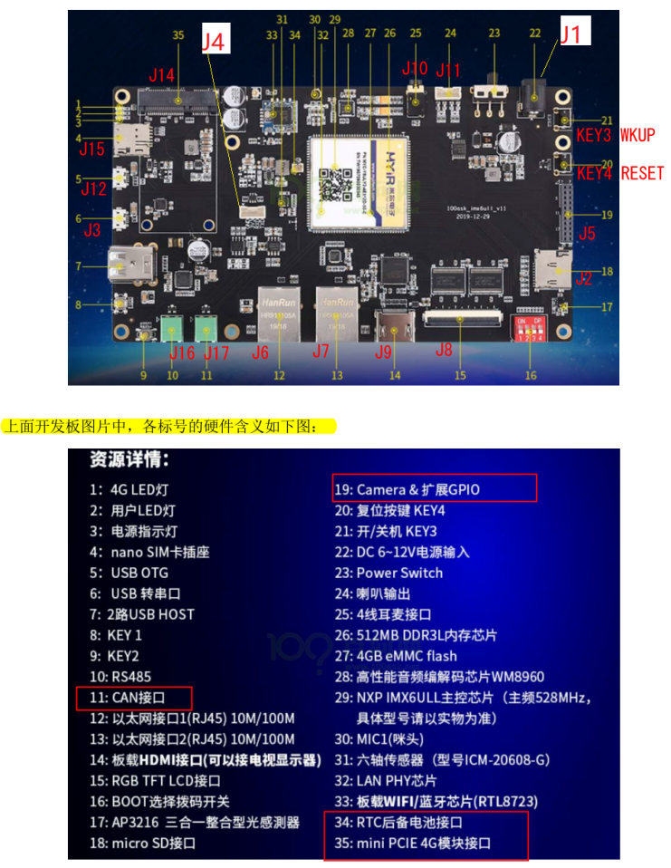

|"资源详情"中的编号|资源名称|对应接插件|芯片名称|芯片编号|供电|使能|输出中断|挂载在哪条总线及其地址|备注|参考代码链接||||
|-|-|-|-|-|-|-|-|-|-|-|-|-|-|
|1|4GLED灯|-|-|-||||||||||
|2|用户LED灯|||||||||||||
|3|电源指示灯|||||||||||||
|4|nanoSIM卡插座|J15|||||||没有真正使用?|||||
|5|USBOTG|J12||||||直接核心板USB_OTG1||||||
|6|USB转串口|J3|CP2104|U5||||UART1|等效于J4|||||
|7|2路USBHOST|||||||||||||
|8|KEY1|||||||||||||
|9|KEY2|||||||||||||
|10|RS485|J16|SP3485|U21||||UART3||||||
|11|CAN接口|J17|TJA1042T/3|U22||||UART3||||||
|12|以太网接口1(RJ45)10M/100M|J6||||||ETH1||||||
|13|以太网接口2(RJ45)10M/100M|J7|LAN8720A|U11||||ENET2|这2个网卡有什么差别|||||
|14|板载HDMI接口(可以接电视显示器)hdmi-transmitter|J9|SIL9022A|U15||||I2C-2地址39||||||
|15|RGB TFT LCD接口|J8||||||I2C-2? 接的SOC||||||
|16|BOOT选择拨码开关|||||||||||||
|17|AP3216三合一整合型光感測器(环境光强度(ALS)、接近距离(PS)和红外线强度(IR)||AP3216C|U9||||I2C-1||||||
|18|microSD接口|J2||||||||||||
|19|Camera&扩展GPIO|J5||||||||||||
|20|复位按键KEY4|||||||||||||
|21|开/关机KEY3|||||||||||||
|22|DC6~12V电源输入|J1||||||||||||
|23|PowerSwitch|||||||||||||
|24|喇叭输出|J11|高性能音频编解码芯片WM8960|U17||||I2C-2地址1a||||||
|25|4线耳麦接口|J10|高性能音频编解码芯片WM8960|U17||||I2C-2地址1a||||||
|26|512MBDDR3L内存芯片||米尔核心板内部|||||||||||
|27|4GBeMMCflash||米尔核心板内部|||||||||||
|28|高性能音频编解码芯片WM8960||高性能音频编解码芯片WM8960|U17||||I2C-2地址1a||||||
|29|NXPIMX6ULL主控芯片(主频528MHz,具体型号请以实物为准)||米尔核心板内部|U1||||||||||
|30|MIC1(咪头)|||||||||||||
|31|六轴传感器(型号ICM-20608-G)||ICM-20608-G |U7||||||||||
|32|LANPHY芯片||米尔核心板内部|||||||||||
|33|板载WIFI/蓝牙芯片(RTL8723)||RTL8723|U20||||USB_HUB1||||||
|34|RTC后备电池接口|J18||||||||||||
|35|miniPCIE4G模块接口|J14|(外接)4G_EC20_ME909S模组|||||||||||
|?||J4||||||UART1||||||
|?|||74LVC16245A|U13||||||||||
|?|USB2.0Hi-SpeedHubController||USB2514Bi-AEZG_QFN36|U18||||直接核心板USB_OTG2||||||
|?|||SY6280AAAC|U19||||||||||
|?|(外部)GPS模块|||||||||git仓:doc_and_source_for_drivers\IMX6ULL\source\09_UART\02_gps\gps_read.c||||