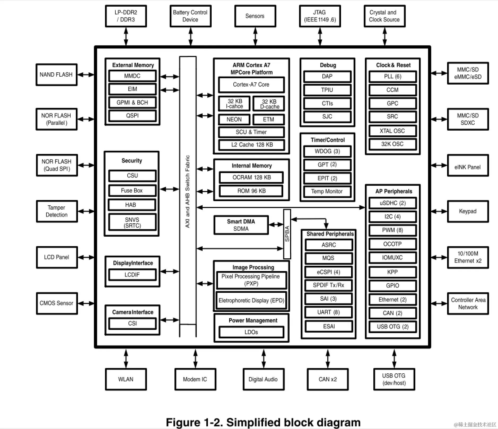
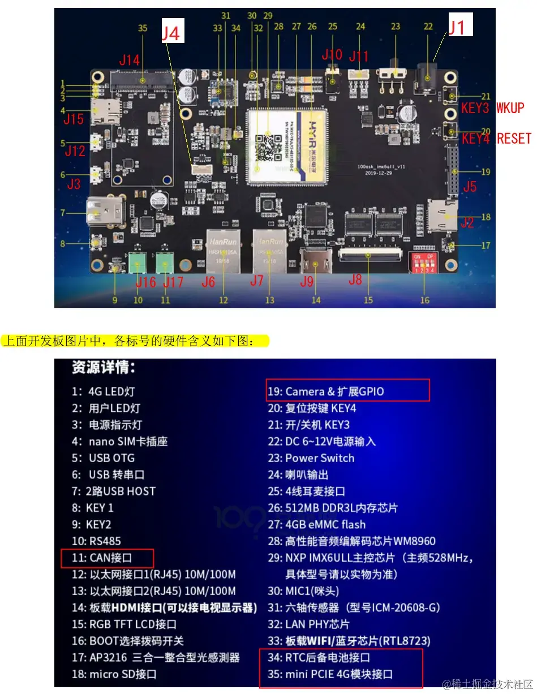
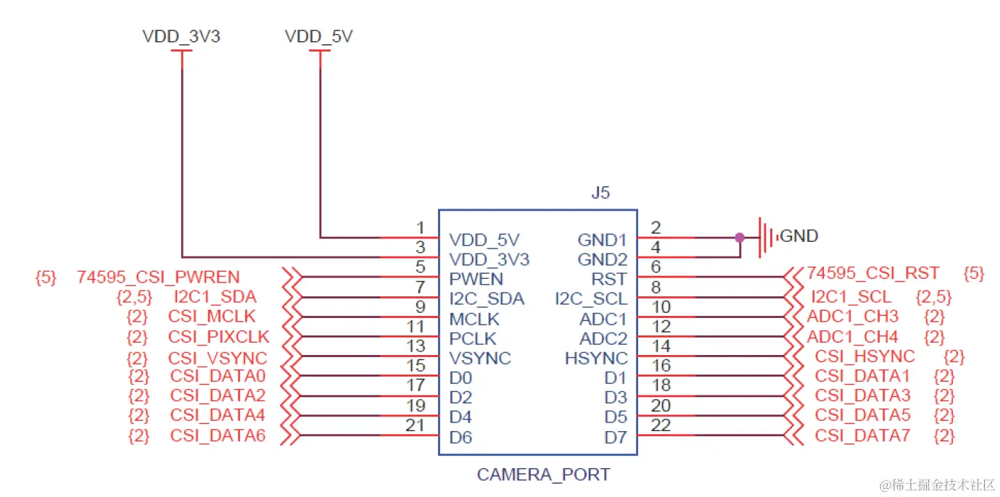
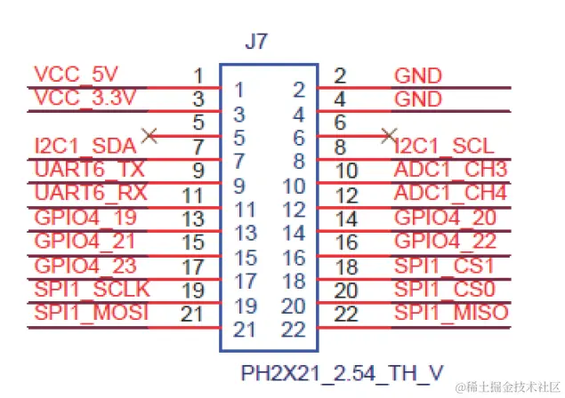
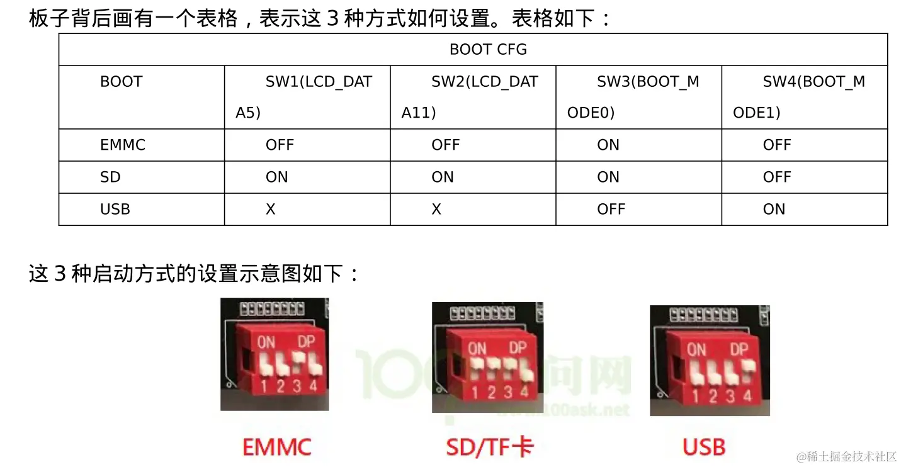
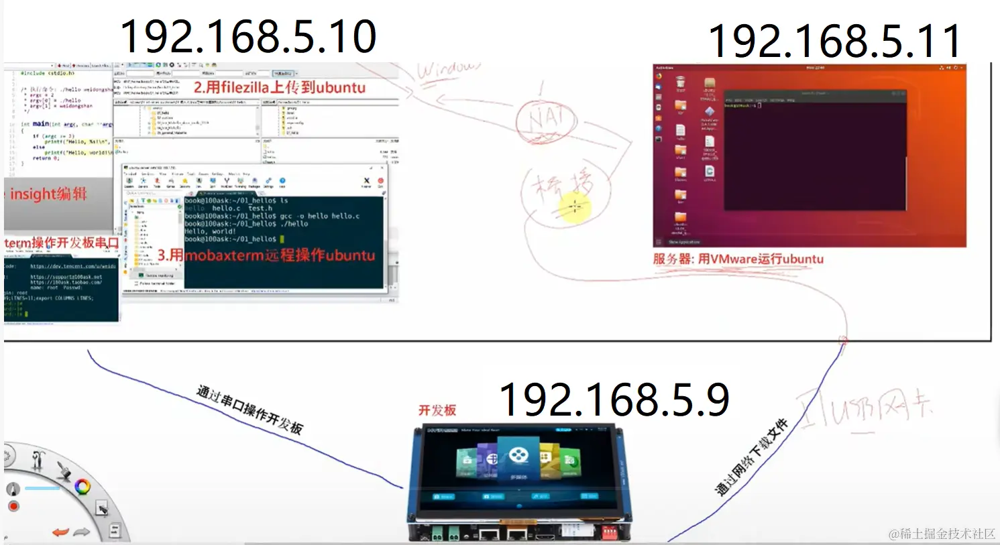
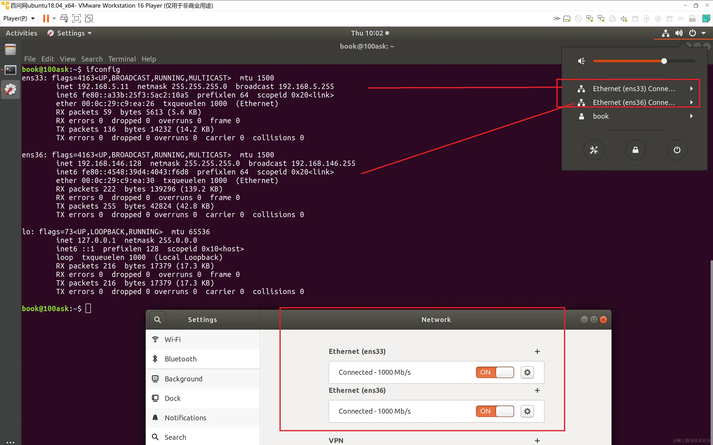
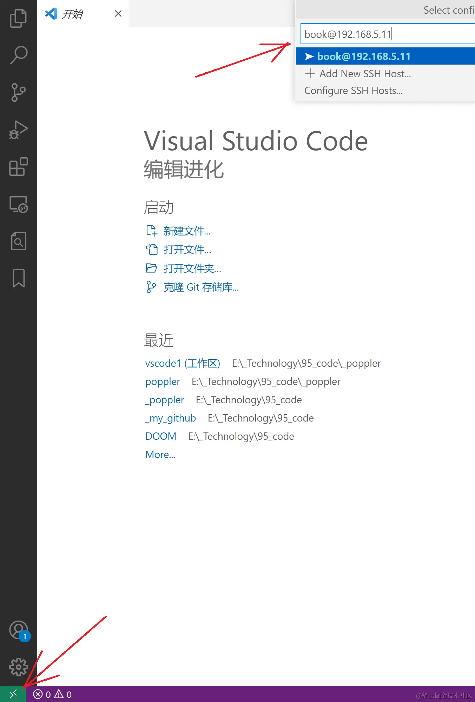
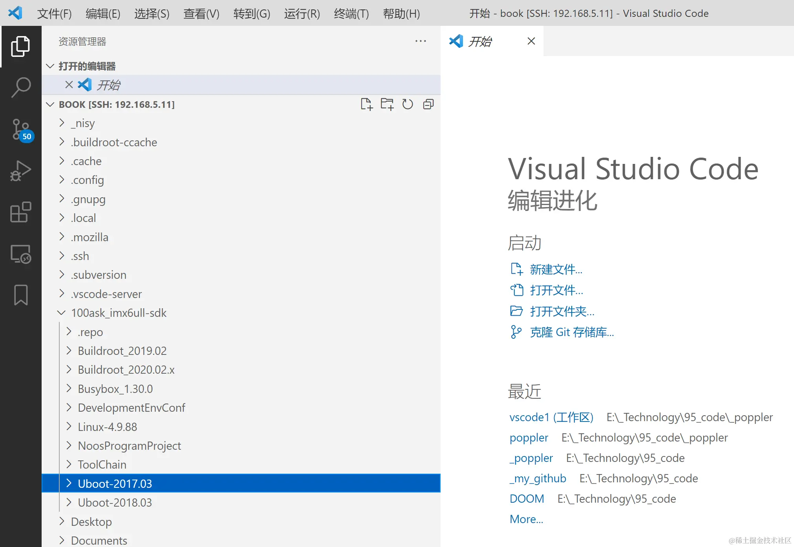

[toc]

备注：下列路径是本人电脑的配置，实际使用请根据自己需要修改。


## 开发环境
IMX6ULL CPU资源



百问网100ask的imx6ull  PRO开发板的接口:

开发板登录名是 root，无需密码


J5插座作为摄像头用时:


J5插座作为IO扩展时:



### 在windows+虚拟机环境下开发

#### 在windows +虚拟机环境下开发（参考《第四 A 章 使用 USB 网卡直连配置网络》）

//启动方式如下：


注意：这个拨码仅仅是uboot的启动，而uboot有可能启动的是sd卡（mmc=0），也考虑启动的是emmc（mmc=1），可以在uboot的环境变量中配置：

```

=> printenv
baudrate=115200
board_name=EVK
board_rev=14X14
boot_fdt=try
......
......
mmcboot=echo Booting from mmc ...; run mmcargs; if test ${tee} = yes; then run loadfdt; run loadtee; bootm ${tee_addr} - ${fdt_addr}; else if test ${boot_fdt} = yes || test ${boot_fdt} = try; then if run loadfdt; then bootz ${loadaddr} - ${fdt_addr}; else if test ${boot_fdt} = try; then bootz; else echo WARN: Cannot load the DT; fi; fi; else bootz; fi; fi;
mmcdev=1      //原始是mmc=1即emmc启动
mmcpart=2
mmcroot=/dev/mmcblk1p2 rootwait rw      //原始是mmc=1即emmc启动
netargs=setenv bootargs console=${console},${baudrate} root=/dev/nfs ip=dhcp nfsroot=${serverip}:${nfsroot},v3,tcp
......
......

Environment size: 2738/8188 bytes
=> setenv mmcdev 0      //改为mmc=0即sd卡启动
=> setenv mmcroot /dev/mmcblk0p2 rootwait rw      //改为mmc=0即sd卡启动
=> saveenv
Saving Environment to MMC...
Writing to MMC(0)... done
=>
```

从开机log可以看到到底是mmc=0即sd卡启动：

```
U-Boot 2017.03 (Oct 29 2022 - 21:06:24 -0400)

CPU:   Freescale i.MX6ULL rev1.1 696 MHz (running at 396 MHz)
CPU:   Industrial temperature grade (-40C to 105C) at 39C
Reset cause: POR
Model: Freescale i.MX6 ULL 14x14 EVK Board
Board: MX6ULL 14x14 EVK
DRAM:  512 MiB
MMC:   FSL_SDHC: 0, FSL_SDHC: 1
Display: TFT7016 (1024x600)
Video: 1024x600x24
In:    serial
Out:   serial
Err:   serial
Net:   No ethernet found.
Normal Boot
Hit any key to stop autoboot:  0
## Error: "findtee" not defined
switch to partitions #0, OK
mmc0 is current device                    <<<<<<<
switch to partitions #0, OK
mmc0 is current device                    <<<<<<<

```

还是mmc=1即emmc启动：

```
U-Boot 2017.03 (Oct 29 2022 - 21:06:24 -0400)

CPU:   Freescale i.MX6ULL rev1.1 696 MHz (running at 396 MHz)
CPU:   Industrial temperature grade (-40C to 105C) at 42C
Reset cause: POR
Model: Freescale i.MX6 ULL 14x14 EVK Board
Board: MX6ULL 14x14 EVK
DRAM:  512 MiB
MMC:   FSL_SDHC: 0, FSL_SDHC: 1
Display: TFT7016 (1024x600)
Video: 1024x600x24
In:    serial
Out:   serial
Err:   serial
Net:   No ethernet found.
Normal Boot
Hit any key to stop autoboot:  0
## Error: "findtee" not defined
switch to partitions #0, OK
mmc1(part 0) is current device                    <<<<<<<
switch to partitions #0, OK
mmc1(part 0) is current device                    <<<<<<<

```

或者在linux系统中查询,如下表示是启动的是sd卡的linux:
```
[root@imx6ull:~]# cat /proc/cmdline
console=ttymxc0,115200 root=/dev/mmcblk0p2 rootwait rw
```
如下是启动的emmc的linux:
```
[root@100ask:~]# cat /proc/cmdline
console=ttymxc0,115200 root=/dev/mmcblk1p2 rootwait rw
```


//调试环境如下：


虚拟机的配置类似如下：


vscode使用ssh remote插件远程登陆vmware的代码：



效果图：



//开发板配置:
ifconfig eth0 192.168.5.9
为了避免每次开机配置，可以：
设置 IP 为固定静态 IP（开机不变） 设置 eth0 为静态 IP 地址, 开发板/etc/network/目录下对
interfaces 文件进行修改 。
`[root@100ask:~]# vi /etc/network/interfaces`
修改并为如下内容，执行 :wq 保存并退出，执行/etc/init.d/S40network restart 重启网络服务。

    auto lo
    iface lo inet loopback
    auto eth0
    iface eth0 inet static
        address 192.168.5.9
        netmask 255.255.255.0
        gateway 192.168.5.1

《4.4.1 文件系统内使用 nfs 挂载 ubuntu 目录》

    [root@100ask:~]# mount -t nfs -o nolock,vers=3 192.168.5.11:/home/book/nfs_rootfs /mnt

#### 在windows +虚拟机环境下开发（参考《第四 B 章 使用路由器配置网络》）

1.windows PC的wifi和路由器连接，比如获得IP是192.168.3.240.虚拟机使用“桥接模式-直接连接物理网络”，比如获得IP是192.168.3.10
2.开发板启动wifi，可以直接执行如下start\_wifi.sh的shell脚本：

    #!/bin/bash
    #启用 wlan0 无线网络设备
    ifconfig wlan0 up
    #扫描周围网络设备
    #iw dev wlan0 scan |grep SSID
    #配置网络连接参数
    rm -rf /etc/wpa_supplicant.conf
    wpa_passphrase weiba1985 19560206 >> /etc/wpa_supplicant.conf
    #连接 wifi 设备
    wpa_supplicant -B -iwlan0 -c /etc/wpa_supplicant.conf
    #查看连接状态
    iw wlan0 link
    #为 wlan0 获取 ip 地址，确认与PC可以相互ping通
    udhcpc -i wlan0
    #查看所有网络设备
    ifconfig -a

比如获得路由器分配的IP是192.168.3.6
3.用mobaxterm可以分别ssh连接到虚拟机和开发板的终端，在开发板的终端把虚拟机的文件系统加入mnt:
`mount -t nfs -o nolock,vers=3 192.168.3.10:/home/book/nfs_rootfs /mnt`

## 代码编译

### 代码下载

执行以下4条命令，为方便大家复制，第3条是很长的命令，使用了\来换行，需要一并拷贝：

    book@100ask:~ git clone https://e.coding.net/codebug8/repo.git
    book@100ask:~$ mkdir -p 100ask_imx6ull-sdk && cd 100ask_imx6ull-sdk
    book@100ask:~/100ask_imx6ull-sdk$ ../repo/repo init -u \
     https://gitee.com/weidongshan/manifests.git -b \
    linux-sdk -m imx6ull/100ask_imx6ull_linux4.9.88_release.xml  --no-repo-verify
    book@100ask:~/100ask_imx6ull-sdk$  ../repo/repo sync -j4

在 \~/.bashrc 的行尾添加如下：

    export ARCH=arm
    export CROSS_COMPILE=arm-buildroot-linux-gnueabihf-
    export   PATH=$PATH:/home/book/100ask_imx6ull-sdk/ToolChain/arm-buildroot-linux-gnueabihf_sdk-buildroot/bin

设置完毕后，要执行  source  \~/.bashrc 命令使其生效，

### 应用程序的编译和执行

我们要想给 ARM 板编译出 hello 程序，需要使用交叉编译工具链，比如：

    $ arm-buildroot-linux-gnueabihf-gcc -o hello hello.c

这样编译出来的 hello 程序才可以在 ARM 板子上运行。
先把编译生成的 hello 文件拷贝到 Ubuntu nfs 服务目录下，备用：

    $ cp  hello   /home/book/nfs_rootfs

### 调试开发板方法1：使用nfs方式

这种方式一般不自己从头开始编译busybox，只用于调试uboot+linux kernel+dts，文件系统即busybox不需要调整的场景。

#### uboot

    u-boot的编译过程如下(编译uboot前必须先配置好工具链等开发环境)：
    book@100ask: ~/100ask_imx6ull-sdk$ cd Uboot-2017.03
    book@100ask: ~/100ask_imx6ull-sdk/Uboot-2017.03$ make distclean
    book@100ask: ~/100ask_imx6ull-sdk/Uboot-2017.03$ make  mx6ull_14x14_evk_defconfig 
    book@100ask: ~/100ask_imx6ull-sdk/Uboot-2017.03$ make

编译后检查是否生效，需要看看开机时间戳是否改变了,如下：

    U-Boot 2017.03 (Oct 29 2022 - 21:06:24 -0400)

#### LINUX内核+dts

为了防止编译没有生效，除了留意打印的编译时间戳，还可以修改一些标记处，烧入单板时检查标记是否生效了，比如kernel顶层Makefile的：

    VERSION = 4
    PATCHLEVEL = 9
    SUBLEVEL = 88
    EXTRAVERSION = 20221029_by_nishengyue        <------  增加标记

烧入单板后应该有类似的打印，说明编译真正生效了：

    [  0.000000] Booting Linux on physical CPU 0x0
    [  0.000000] Linux version 4.9.8820221029_by_nishengyue (book@100ask) (gcc version 7.5.0 (Buildroot 2020.02-gee85cab) ) #1 SMP PREEMPT Sun Oct 30 11:46:38 CST 2022

在
`~/100ask_imx6ull-sdk/Linux-4.9.88`
路径下，kernel的编译过程如下（编译内核前需要先配置好工具链等一些环境变量）：

    make mrproper
    make 100ask_imx6ull_defconfig
    make zImage  -j4
    make dtbs V=1
    cp arch/arm/boot/zImage ~/nfs_rootfs
    cp arch/arm/boot/dts/100ask_imx6ull-14x14.dtb  ~/nfs_rootfs

如果出现    multiple definition of \`yylloc\`  报错，请参考该链接解决：[https://blog.csdn.net/qq\_36393978/article/details/117695708 ](https://blog.csdn.net/qq_36393978/article/details/117695708 "https://blog.csdn.net/qq_36393978/article/details/117695708 ")

这样在nfs\_rootfs 能看到zImage和100ask\_imx6ull-14x14.dtb 文件。

#### 编译内核MODULE

    book@b ook-virtual-machine:~$ cd ~/100ask_imx6ull-sdk/Linux-4.9.88/
    book@100ask:~/100ask_imx6ull-sdk/Linux-4.9.88$ make ARCH=arm CROSS_COMPILE=arm-buildroot-linux-
    gnueabihf- modules

安装内核module执行以下命令：

    book@book-virtual-machine:~$ cd ~/100ask_imx6ull-sdk/Linux-4.9.88/
    book@100ask:~/100ask_imx6ull-sdk/Linux-4.9.88$   sudo   make     ARCH=arm   INSTALL_MOD_PATH=/home/book/nfs_rootfs/ modules_install

这样在 nfs\_rootfs 能看到 lib 文件夹。

#### 安装编译的内核+设备树+module

执行命令拷贝：

    cp  /mnt/zImage  /boot
    cp  /mnt/*.dtb   /boot
    cp  /mnt/lib/modules  /lib  -rfd

#### uboot从nfs网络启动

1.编译的结果拷贝到nfs目录下：

    book@100ask:~/100ask_imx6ull-sdk/Buildroot_2020.02.x/output/images$ cp zImage  ~/nfs_rootfs/
    book@100ask:~/100ask_imx6ull-sdk/Buildroot_2020.02.x/output/images$ cp 100ask_imx6ull-14x14.dtb  ~/nfs_rootfs/
    book@100ask:~/100ask_imx6ull-sdk/Buildroot_2020.02.x/output/images$ cp -rf  rootfs.tar.bz2  ~/nfs_rootfs/
    book@100ask:~/100ask_imx6ull-sdk/Buildroot_2020.02.x/output/images$ cd ~/nfs_rootfs
    book@100ask:~/nfs_rootfs$ sudo tar  xjf  rootfs.tar.bz2

2.ubuntu开启tftp:
在 Ubuntu 中执行以下命令安装 TFTP 服务：

    sudo apt-get install tftp-hpa tftpd-hpa 

然后，创建 TFTP 服务器工作目录，并打开 TFTP 服务配置文件，如下:

    sudo vim /etc/default/tftpd-hpa 

在配置文件/etc/default/tftpd-hpa 中，添加以下字段：

    TFTP_DIRECTORY="/home/book/nfs_rootfs" 
    TFTP_OPTIONS="-l  -c  -s" 

最后，重启 TFTP 服务:

    sudo service tftpd-hpa restart 

查看 tftp 服务是否在运行,运行如下命令，即可查看是否在后台运行。

    ps -aux | grep "tftp"

3.ubooot阶段启动停住后，输入如下：

    => setenv serverip 192.168.5.11     //设置服务器的 IP 地址，这里指的是 Ubuntu 主机 IP 
    => setenv ipaddr 192.168.5.9         //设置开发板的 IP 地址。 
    => ping 192.168.5.11     //检查是否能ping通
    => setenv nfsroot /home/book/nfs_rootfs   //设置 nfs 文件系统所在目录。 
    => run netboot            //设置完成后，运行网络启动系统命令 

### 调试开发板方法2：使用编译buildroot套件并烧录进单板

这种方式一般可以一次性编译uboot+linux kernel+dts+文件系统busybox，操作简单长，但是如果全编译时间长。

#### buildroot套件的全编译

下面以100ask\_imx6ull\_pro\_ddr512m\_systemV\_qt5\_defconfig配置文件为例，在ubuntu终端上说明 Buildroot 的配置过程,在
`~/100ask_imx6ull-sdk/Buildroot_2020.02.x`
路径下：

    make clean
    make 100ask_imx6ull_pro_ddr512m_systemV_qt5_defconfig
    make all

注：其中buildroot支持的配置如下：

    book@100ask:~/100ask_imx6ull-sdk/Buildroot_2020.02.x$  make list-defconfigs
    Built-in configs:
      100ask_imx6ull_mini_ddr512m_systemV_core_defconfig - Build for 100ask_imx6ull_mini_ddr512m_systemV_core
      100ask_imx6ull_mini_ddr512m_systemV_qt5_defconfig - Build for 100ask_imx6ull_mini_ddr512m_systemV_qt5
      100ask_imx6ull_pro_ddr512m_systemV_core_defconfig - Build for 100ask_imx6ull_pro_ddr512m_systemV_core
      100ask_imx6ull_pro_ddr512m_systemV_qt5_defconfig - Build for 100ask_imx6ull_pro_ddr512m_systemV_qt5
      100ask_stm32mp157_pro_ddr512m_busybox_core_defconfig - Build for 100ask_stm32mp157_pro_ddr512m_busybox_core
    ....
      qemu_aarch64_virt_defconfig         - Build for qemu_aarch64_virt
      qemu_arm_versatile_defconfig        - Build for qemu_arm_versatile
      qemu_arm_versatile_nommu_defconfig  - Build for qemu_arm_versatile_nommu
      qemu_arm_vexpress_defconfig         - Build for qemu_arm_vexpress
      qemu_arm_vexpress_tz_defconfig      - Build for qemu_arm_vexpress_tz
    ......
      raspberrypi0_defconfig              - Build for raspberrypi0
      raspberrypi0w_defconfig             - Build for raspberrypi0w
      raspberrypi2_defconfig              - Build for raspberrypi2
      raspberrypi3_64_defconfig           - Build for raspberrypi3_64
      raspberrypi3_defconfig              - Build for raspberrypi3
      raspberrypi3_qt5we_defconfig        - Build for raspberrypi3_qt5we
      raspberrypi4_64_defconfig           - Build for raspberrypi4_64
      raspberrypi4_defconfig              - Build for raspberrypi4
      raspberrypi_defconfig               - Build for raspberrypi
      .......

#### 在 buildroot 下进入 menuconfig 包选择配置配置界面

    book@100ask: ~/100ask_imx6ull-sdk/Buildroot_2020.02.x$ make menuconfig

#### buildroot 下单独编译 u-boot

    book@100ask: ~/100ask_imx6ull-sdk/Buildroot_2020.02.x$ make uboot-rebuild 

#### buildroot 下单独编译内核+dts

在
`book@100ask:~/100ask_imx6ull-sdk/Buildroot_2020.02.x/dl/linux/git`
路径下
```
find . -iname *.o|xargs rm -rf *.o
make mrproper
make 100ask_imx6ull_defconfig
make zImage  -j4
make dtbs
cp arch/arm/boot/zImage  /home/book/100ask_imx6ull-sdk/Buildroot_2020.02.x/output/images/
cp arch/arm/boot/dts/100ask_imx6ull-14x14.dtb  /home/book/100ask_imx6ull-sdk/Buildroot_2020.02.x/output/images/

book@100ask: ~/100ask_imx6ull-sdk/Buildroot_2020.02.x$ make linux-rebuild
```
#### buildroot 下进入内核 make menuconfig 配置选项界面

    book@100ask: ~/100ask_imx6ull-sdk/Buildroot_2020.02.x$ make linux-menuconfig 

#### buildroot 下单独编译某个软件包

    book@100ask: ~/100ask_imx6ull-sdk/Buildroot_2020.02.x$ make <pkg>-rebuild 

#### buildroot 下进入 busybox 配置界面

    book@100ask: ~/100ask_imx6ull-sdk/Buildroot_2020.02.x$ make busybox-menuconfig 

buildroot 下生成系统 sdk,最后生成的目录在 output/images/目录下

    book@100ask: ~/100ask_imx6ull-sdk/Buildroot_2020.02.x$ make sdk 

#### buildroot 下检查文件系统是否真正重编译

可以在这个文件中做标记：

    vi /home/book/100ask_imx6ull-sdk/Buildroot_2020.02.x/board/100ask/nxp-imx6ull/rootfs-overlay/systemV/etc/issue 

烧入单板后，检查登陆后，是否有自己标记的字符串。
